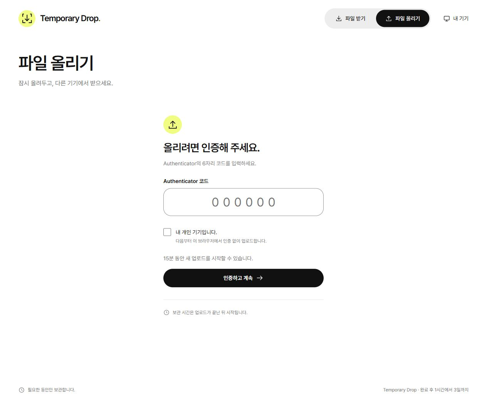
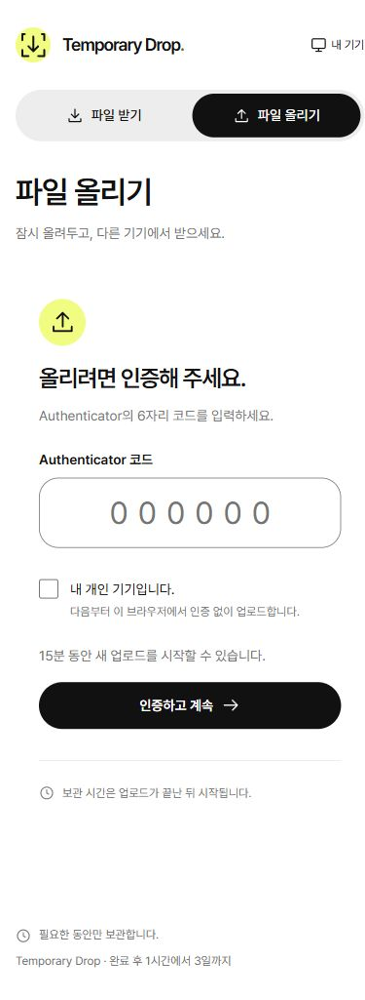

# 프런트엔드 리디자인 운영 배포

2026-10-03 · Asia/Seoul

## 적용 내용

전체 리디자인과 함께 사용자의 후속 요청을 반영했다. 기본 UI 폰트는 **Pretendard Variable**, 가장 바깥 페이지 배경은 **#FFFFFF**다. 내부 보조 표면의 #F8F8F8, 라임 강조와 상태 색상은 기존 의미를 유지한다.

[Pretendard 공식 배포](https://github.com/orioncactus/pretendard/tree/v1.3.9)의 1.3.9 가변 다이나믹 서브셋을 자체 호스팅한다. 92개 WOFF2 파일은 원본 그대로이며, CSS의 상대 경로만 변경하고 포맷을 정리했다. Unicode 범위·`font-display: swap`을 유지하여 현재 화면에 필요한 글자 파일만 요청한다. 원본 라이선스는 `public/fonts/pretendard/1.3.9/LICENSE.txt`에 포함한다. 앱의 CSP `font-src 'self'`와 호환되며 버전별 폰트 경로에 1년 immutable 캐시를 적용한다.

이 기록은 [초기 로컬 구현 기록](./planning/06-리디자인-구현-검증.md)의 시스템 폰트·배경·배포 상태를 대체하는 후속 변경 기록이다.

## 배포

| 항목          | 값                                                  |
| ------------- | --------------------------------------------------- |
| 운영 주소     | https://drop.rmarkfcl.workers.dev                   |
| Worker        | `drop`                                              |
| 설정          | `wrangler.production.jsonc`                         |
| 배포 버전     | `2aba871f-f3ec-4b2a-93c2-db0c2871b783`              |
| 정적 파일     | 103개, 신규·변경 98개 업로드                        |
| 사용자 데이터 | migration·비밀 변경 없이 기존 D1/R2 바인딩으로 배포 |

기존 운영 설정 검증과 `npm run check`가 통과한 뒤 운영 설정으로 dry-run과 실제 Wrangler deploy를 수행했다.

## 검증

- 타입·포맷·59개 테스트·production build 통과.
- `/`, `/upload`, `/devices`, `/shortcuts` HTTP 200.
- 익명 `/api/files` HTTP 401. `/api/auth/status`는 production(`local=false`), 업로드 인증 없음·다운로드 잠김으로 응답.
- 운영 font CSS·대표 WOFF2 파일 HTTP 200, 응답 해시가 빌드 파일과 일치. WOFF2 MIME과 immutable 캐시 확인.
- 배포된 app CSS에 Pretendard 선언과 `--page-bg:#fff` 확인.
- 실제 운영 브라우저: 제목·버튼 Pretendard 선언, `document.fonts.status=loaded`, 한글의 Pretendard font check 성공. html/body 배경 `rgb(255, 255, 255)`.
- 390px 운영 모바일에서 가로 넘침 없음(`scrollWidth=375`, `innerWidth=390`).
- 운영 UI의 일시적 인증 상태 연결 실패는 ‘다시 연결’으로 복구되었고 정상 화면을 캡처했다.

이번 확인은 폰트·배경과 새 UI의 배포 검증이다. iPhone 실기기·스크린리더 전체 과업·GiB급 파일 검증 범위는 초기 기록과 동일하다.

