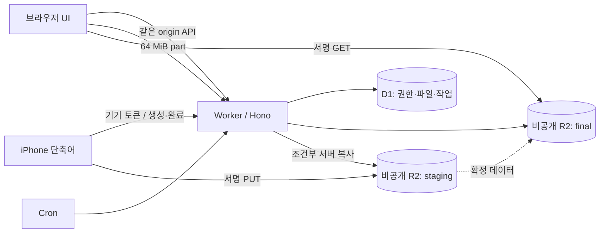
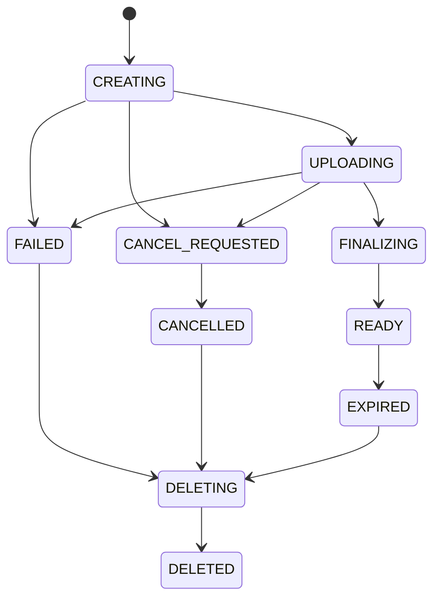

# Personal Temporary Drop — 상세 구현 계획

작성일: 2026-10-02 · 기준: 사용자가 첨부한 v1 기획서 · 문서 상태: 구현 착수용 설계안

이 문서는 실제 서비스 구현·배포 결과가 아니다. 원안의 요구사항을 실행 가능한 명세로 구체화한 계획이다. **확정 요구**는 원문에 있는 내용, **권고 결정**은 이번 설계에서 보완한 기본안, **검증 게이트**는 구현 초기에 실제 환경으로 확인해야 하는 사항이다. 특정 라이브러리의 버전과 실제 기기 성능은 아직 확정하지 않았다.

## 1. 먼저 결정할 제품의 형태

개인 소유자가 자신의 기기와 임시로 사용하는 PC 사이에서 파일을 전달하는 작은 서비스다. 계정 가입, 폴더 관리, 협업, 장기 보관 기능 없이 **올리기 → 잠깐 보관 → 받기 → 자동 삭제**에 집중한다.

가장 중요한 불변 조건은 다음과 같다.

1. 개인 기기의 업로드 자격은 폐기 전까지 서버에서 유효하다. 브라우저 쿠키가 지워지면 재등록할 수 있다.
2. 공용 PC에서는 TOTP 인증 시점부터 정확히 900초 동안 새 업로드를 생성한다. 활동으로 연장하지 않는다.
3. 이미 생성된 업로드는 파일별 capability로 진행한다. 900초 세션의 자연 만료가 이를 중단하지 않는다.
4. 업로드 capability는 특정 파일의 전송·상태 조회·완료·취소만 허용한다. 파일 목록이나 기기 관리에는 쓸 수 없다.
5. 다운로드 PIN은 전체 파일 목록에 대한 약한 접근 장벽이다. 파일별 비밀번호나 개인별 권한이 아니다.
6. 완료·검증된 파일만 목록에 표시한다. R2에 데이터가 있다는 이유만으로 다운로드 가능 상태가 되지 않는다.
7. 접근 만료는 서버 시간으로 판단하며, 물리 삭제가 지연되어도 신규 다운로드 권한을 발급하지 않는다.
8. 취소·완료·기기 폐기·정리 작업은 중복 실행과 처리 도중 장애를 견딘다.

## 2. 원안에서 보완할 사항

| 주제 | 원안의 빈틈 또는 주의점 | 권고 결정 |
|---|---|---|
| 영구 기기 | 브라우저가 쿠키를 무기한 유지한다는 보장은 없음 | 서버 credential은 revoke까지, 쿠키는 365일 요청·활동 시 갱신. 삭제되면 재인증 |
| 업로드 시작 | 파일 선택·대기열 등록·서버 생성 중 무엇이 시작인지 불명확 | 서버가 인증·용량 예약·upload 레코드를 승인한 시점. 대기열에만 있으면 미시작 |
| 파일 만료 | created_at 기준이면 긴 전송 중 보관 시간이 소진됨 | 최초 READY 확정 시각 + 선택한 보관 시간 |
| 다운로드 만료 | 이미 발급한 R2 URL에는 D1의 사후 변경이 적용되지 않음 | GET URL TTL을 남은 파일 수명과 다운로드 세션 수명으로 제한. 이미 열린 전송의 즉시 차단은 보장하지 않음 |
| iPhone 직접 PUT | 완료 콜백·검증·덮어쓰기 방어가 빠짐 | staging PUT → HEAD 검증 → 조건부 서버 복사 → READY |
| 기기 revoke | 연결된 capability를 계속 허용할지 불명확 | 명시적 revoke는 후속 capability 요청도 차단. 자연 만료와 구별 |
| 로그아웃 | 진행 중 업로드 중단 여부가 불명확 | 공용 PC의 ‘이 PC에서 종료’는 세션과 연결된 업로드를 취소. 확인 대화상자 표시 |
| Rate limit | 기본 binding에 300초 설정을 그대로 쓸 수 없음 | edge의 60초 제한 + D1의 정확한 300초 시도 창 |
| 저장 비용 | 몇 시간만 보관하면 그 시간만큼 과금된다는 가정 | 공식 문서의 일별 최대 저장량 평균으로 추정 |
| R2와 D1 | 한 트랜잭션으로 묶을 수 없음 | 중간 상태·조건부 업데이트·재조정 작업으로 일관성 회복 |
| 3일 lifecycle | 최대 보관 3일과 동일한 값이면 여유 없음 | 최종 파일 fallback 7일, staging 2일, 미완료 multipart 1일을 제안 |
| 테이블 중복 | uploads/files에 파일명·크기·상태가 중복됨 | files가 파일 생명주기 원장, upload_parts가 전송 상세. API 명칭 uploads는 유지 |
| 인증 종류 | 다운로드와 관리자 재인증에도 별도 자격 필요 | 핵심 3종에 다운로드 세션·관리자 재인증 grant를 명시적으로 추가 |

R2 서명 URL은 만료 전 재사용할 수 있고 S3 API 도메인을 사용한다. 따라서 서비스 도메인이 그대로 유지되는 다운로드를 약속하지 않는다. [Cloudflare: Presigned URLs](https://developers.cloudflare.com/r2/api/s3/presigned-urls/)

## 3. 범위와 기본값

### 3.1 v1에 포함

- 한국어 우선 UI, 데스크톱·태블릿·모바일 반응형.
- `/`, `/upload`, `/devices` 세 경로와 페이지 내부 대화상자.
- 고정 PIN 다운로드, 임시·30일 다운로드 세션.
- TOTP 인증, 공용 PC 15분 업로드 세션, 신뢰 기기 등록·폐기.
- 복수 파일 선택, 파일별 보관 시간, 전송 대기열, 진행률, 실패 part 재시도, 취소.
- Windows·iPad·iPhone Safari multipart 경로와 iPhone 단축어 경로.
- 자동 만료, 물리 삭제 재시도, 미완료 업로드 정리, 고아 객체 조사.
- 운영자가 Cloudflare 접근 권한으로 수행하는 초기 설정·복구 절차.

### 3.2 v1에서 제외

다중 사용자, 회원 가입, 폴더·공유 폴더, 미리보기·썸네일, 서버 ZIP 생성, 전체 일괄 다운로드, 종단간 암호화, 악성코드 검사, 파일별 PIN, 브라우저 재시작 후 복구, iOS 백그라운드 전송 보장, 별도 네이티브 앱, 알림 메일, CDN 캐시. 서버 측 조기 삭제 UI는 v1.1 후보이며 v1은 진행 중 취소와 자동 만료만 제공한다.

### 3.3 권고 설정표

| 설정 | 초기 제안값 | 의미 |
|---|---:|---|
| TEMP_SESSION_TTL | 900초 | 새 업로드 생성 권한 |
| UPLOAD_CAPABILITY_TTL | 6시간 | 업로드 생성 시부터 고정, 자동 연장 없음 |
| UPLOAD_ADMISSION_IDLE_TTL | 10분 | 생성 후 첫 part가 없으면 예약 회수 |
| WEB_MAX_FILE_BYTES | 32 GiB | ‘16 GiB+’를 유한한 제품 상한으로 구체화 |
| SHORTCUT_MAX_FILE_BYTES | 5 GiB 이하 | 플랫폼 상한. 실제 지원 약속은 기기 시험 결과로 결정 |
| WEB_PART_BYTES | 64 MiB | 서버가 생성 시 고정, 중간 변경 금지 |
| DESKTOP_PART_CONCURRENCY | 4 | 탭 전체 최대 4개, 파일마다 4개가 아님 |
| MOBILE_PART_CONCURRENCY | 2 | 불안정하면 1개로 축소 |
| ACTIVE_FILE_CONCURRENCY | 2 | 전체 part 슬롯을 두 파일에 공정 배분 |
| SELECTION_MAX_FILES | 50개 | UX 한도. 서버는 별도 제한 적용 |
| MAX_ACTIVE_UPLOADS | 전체 8개 / 발급 주체당 4개 | 파일 예약 남용 방지 |
| MAX_RESERVED_AND_READY_BYTES | 100 GiB | 보관 중 + 전송 예약의 논리 상한 |
| MAX_DAILY_ADMITTED_BYTES | 200 GiB | UTC 일자 기준 누적 생성 승인량, 취소해도 환급하지 않음 |
| RETENTION | 1h / 6h / 24h / 72h | 기본 24h, 완료부터 계산 |
| DOWNLOAD_SESSION_TTL | 2시간 / 기억 시 30일 | 전자는 session cookie여도 서버 hard expiry 2시간 |
| PRESIGNED_GET_TTL | 최대 300초 | 파일·다운로드 세션 잔여 시간보다 길지 않음 |
| SHORTCUT_PUT_TTL | 최대 2시간 | upload capability보다 짧음 |
| ADMIN_GRANT_TTL | 5분 | 관리 목적·대상에 묶인 일회용 grant |
| CLEANUP_INTERVAL | 15분 | 작은 배치로 반복, 시간당으로 낮출 수 있음 |
| FINAL_LIFECYCLE_FALLBACK | 7일 | 정상 삭제 스케줄을 대신하지 않음 |
| STAGING_LIFECYCLE | 2일 | URL 재사용으로 뒤늦게 생성된 객체까지 청소 |
| MULTIPART_ABORT_FALLBACK | 1일 | capability 6시간 이후 여유를 둠 |

이 값들은 원안의 확정 수치와 신규 제안을 섞지 않기 위해 별도 설정으로 관리한다. 32 GiB·100 GiB·200 GiB 및 15분 Cron은 이번 설계의 제안값이다. 상한을 올리기 전에 비용·실기기 시험을 다시 수행한다.

6시간에 16 GiB를 전송하려면 순수 payload 기준 약 6.36 Mbit/s, 32 GiB는 약 12.73 Mbit/s가 필요하다. 재시도·프로토콜 오버헤드를 감안하면 더 빠른 회선이 필요하다. 예상 완료 시간이 capability 만료를 넘으면 사용자가 전송 전에 알 수 있게 한다.

## 4. 사용자 시나리오와 인수 기준

| ID | 시나리오 | 완료 기준 |
|---|---|---|
| U01 | 개인 Windows 최초 등록 | TOTP + 명시적 체크 + 기기명으로 등록, 재방문 시 업로드 선택 즉시 가능 |
| U02 | 공용 PC에서 업로드 | 신뢰 체크 기본 OFF, 성공 후 15분 카운트다운, 새 권한 자동 연장 없음 |
| U03 | 14분째 대용량 전송 시작 | 15분 경과 후 추가 생성 401, 기존 parts·complete는 6시간 내 성공 |
| U04 | 만료 후 대기열 처리 | 아직 생성되지 않은 파일은 ‘인증 필요’, 진행 중 파일은 계속 |
| U05 | 네트워크 중단 | 같은 탭·File 객체 유지 중 완료 part 보존, 실패 part만 재전송 |
| U06 | 탭 닫기 | 복구 미지원 안내, 백엔드가 만료 예약·multipart를 자동 정리 |
| U07 | 다운로드 | PIN 인증 전 파일명·개수 비노출, 인증 후 READY·미만료 파일만 표시 |
| U08 | 파일 만료 | 서버가 추가 URL 발급 거부, 다음 조회에서 목록 제외 |
| U09 | iPhone 단축어 | 공유 입력마다 별도 업로드, 검증·확정 성공 후에만 ‘완료’ 표시 |
| U10 | 분실 기기 폐기 | 재인증 후 해당 기기로 새 생성·후속 capability 요청 불가 |
| U11 | 공용 PC 종료 | 현재 공용 세션·다운로드 세션 종료, 진행 업로드 취소 요청 및 메모리 제거 |
| U12 | 장애 중 완료 재호출 | 같은 fileId·최초 completedAt 반환, 파일 중복·보관 연장 없음 |

## 5. 아키텍처와 기술 선택



단일 Worker가 정적 자산, API, scheduled handler를 제공한다. D1·R2는 환경별로 분리한다. 하나의 R2 버킷 안에 `staging/`과 `final/` prefix를 나누는 것이 초기 운영에는 충분하다. 다른 서비스와 버킷·서명 키를 공유하지 않는다.

| 계층 | 선택 | 이유·구현 지침 |
|---|---|---|
| UI build | Vite + TypeScript | 원안 유지, 버전은 착수 시 안정판 고정 |
| UI rendering | React + TypeScript 권고 | 전송 대기열·대화상자·인증 상태의 조합 관리. 원안에 추가하는 의존성 |
| Styling | CSS variables + CSS Modules | 세 화면 규모에 맞게 단순화, 디자인 토큰 공유 |
| Routing | 경량 client router | route 변경으로 업로드 엔진을 파괴하지 않는 app shell |
| API | Hono on Workers | 인증 middleware와 도메인 서비스 분리 |
| Validation | 공유 schema 라이브러리 | 클라이언트 안내와 서버 검증 동일 규칙. 서버가 최종 권위 |
| Storage | R2 Standard | 임시 파일용, public access 비활성 |
| Database | D1 + SQL migrations | 권한·상태·시도 제한 한곳 관리, v1 read replication 사용 안 함 |
| Signing / copy | 호환 검증한 SigV4 도구 또는 AWS SDK v3 | 서명과 CopyObject만 필요한 모듈 포함, CPU·번들 측정 |
| TOTP | RFC 6238 호환 라이브러리 | 자체 암호 알고리즘 작성 피함, 공식 벡터 시험 |
| Browser upload | XMLHttpRequest + Blob.slice | part별 업로드 진행률 이벤트 활용 |
| Tests | 단위 테스트 + Workers 환경 통합 + 브라우저 E2E | 실제 R2·실기기 시험 별도 |
| Observability | Workers logs / metrics + D1 audit | 토큰·PIN·서명 URL·파일 본문 비기록 |

KV, Durable Objects, Queues는 초기에는 도입하지 않는다. D1의 조건부 업데이트로 충분한지 먼저 시험한다. 상태 경합 복잡도가 실제로 문제가 되면 업로드당 Durable Object를 ADR로 재검토한다. 런타임의 메모리 변수는 인증·잠금·작업 상태의 원장으로 사용하지 않는다.

R2 Workers API는 multipart 생성·재개·part 업로드·완료·취소를 제공한다. 업로드별 상태를 D1에 두는 설계가 이에 대응한다. [Cloudflare: Multipart Workers API](https://developers.cloudflare.com/r2/api/workers/workers-multipart-usage/)

## 6. 인증과 권한

### 6.1 권한 표

| 동작 | Download session | Temp session | Browser device | Shortcut device | Upload capability | Admin grant |
|---|---|---|---|---|---|---|
| 목록·다운로드 | O | X | X | X | X | X |
| 웹 upload 생성 | X | O | O | X | X | X |
| Shortcut upload 생성 | X | X | X | O | X | X |
| 해당 upload 상태·part·완료·취소 | X | X | X | X | O | X |
| 기기 목록 | X | X | O | X | X | 해당 목적일 때 O |
| 기기 발급·폐기 | X | X | 재인증 추가 필요 | X | X | 해당 목적·대상에 한해 O |

업로드할 수 있다는 이유로 전체 파일 목록을 보여주지 않는다. 자기 업로드의 완료 결과만 capability로 확인할 수 있다. 다운로드 탭으로 이동하면 별도 PIN이 필요할 수 있다. Shortcut 토큰은 업로드 전용이며 관리자 토큰이 아니다.

### 6.2 Credential 저장과 쿠키

- device/session/capability 원문은 암호학적 난수 32바이트, base64url 표현. URL query에 넣지 않는다.
- D1에는 SHA-256 token hash와 타입·scope·revokedAt·parentId를 저장한다. 충분히 랜덤한 토큰에는 저엔트로피 비밀번호용 느린 해시가 필수는 아니다.
- 브라우저 device: `__Host-td`, temporary: `__Host-ps`, download: `__Host-da`. `Secure; HttpOnly; SameSite=Strict; Path=/`, Domain 미지정.
- device 쿠키 Max-Age는 365일을 요청하지만 실제 보존은 브라우저 정책에 달려 있다. 매 part마다 Set-Cookie 하지 않고 일 단위로만 갱신한다.
- temporary cookie Max-Age 900과 서버 expiresAt을 모두 적용한다.
- download remember=false는 Max-Age 없는 쿠키 + D1 2시간 만료. 브라우저 세션 복원 가능성이 있으므로 ‘창을 닫으면 반드시 로그아웃’이라고 쓰지 않는다.
- 다운로드 기억 옵션은 기본 OFF, ‘내 기기에서만 30일 동안 기억’으로 표시한다.
- 관리자 grant는 purpose·target·expiry가 있는 일회용 256bit 토큰, 브라우저 메모리에만 보관한다.
- capability, TOTP, PIN, 관리 grant, 서명 URL을 localStorage·sessionStorage·IndexedDB·Service Worker cache에 저장하지 않는다.
- 공용 PC 업로드 페이지에서는 Service Worker를 등록하지 않는다. 브라우저 비밀번호 저장을 강제로 통제할 수 있다고 약속하지 않는다.

### 6.3 TOTP와 재사용 방지

6자리, 30초, HMAC-SHA1, 최초 허용 clock skew는 ±1 step을 제안한다. 허용 창을 더 넓히지 않는다. 서버 시간을 기준으로 검증한다. 성공한 counter를 D1의 `totp_uses(secret_version, time_step)` UNIQUE 키로 소비한다. 동시 요청 중 하나만 성공한다. 이미 사용한 코드는 다음 30초 코드를 기다리도록 안내한다. [RFC 6238](https://www.rfc-editor.org/rfc/rfc6238.html)

TOTP 검증 후 temp session 발급 또는 신뢰 기기 등록을 **한 의도(intent)**로 완료한다. 같은 코드를 두 API에서 연속 소비하게 만들지 않는다. 로그인 후 기기 폐기처럼 다른 의도를 실행하려면 새 코드가 필요하다.

등록 API에 `trustDevice=true`만 주면 어떤 브라우저든 장기 credential을 받는 구조이므로 기본 OFF 및 기기명 입력이 필요하다. 외부 URL 파라미터로 신뢰 체크를 켜지 않는다.

### 6.4 Rate limit 상세

Workers binding은 edge 완충으로 `10회/60초/IP/인증종류` 정도를 시작점으로 사용한다. 정확한 보안 한도는 D1에 최근 시도 timestamp를 기록해 판정한다. binding의 period는 10 또는 60초이며 카운터는 위치별·eventually consistent이다. [Cloudflare: Rate Limiting](https://developers.cloudflare.com/workers/runtime-apis/bindings/rate-limit/)

권고 정책은 TOTP **모든 제출 5회/연속 300초/IP**, PIN **모든 제출 10회/연속 300초/IP**이다. 원안의 ‘실패만’보다 단순하고 병렬 추측 방어가 명확한 보수적 변경이다. 성공해도 즉시 카운터를 지우지 않는다. 300초 이후 해당 시도만 만료한다.

전역 TOTP 제출 60회/300초, PIN 100회/300초를 초기 보조 상한으로 둔다. 분산 공격을 줄이는 대신 소유자도 일시 차단될 수 있으므로 장기·무기한 자동 계정 잠금은 하지 않는다. 운영자 CLI 복구 절차를 둔다. IP는 Cloudflare가 신뢰해 제공하는 값만 사용하고 외부 임의 X-Forwarded-For를 믿지 않는다. 저장값은 회전 pepper로 HMAC 처리하고 단기 보존한다.

정확한 슬라이딩 창의 구현: 하나의 원자 SQL `INSERT ... SELECT ... WHERE recent_count < limit`로 시도를 예약한다. IP 및 전역 조건을 같은 insert에서 확인하고 반환 row가 없으면 429. 단순 SELECT 후 INSERT는 동시 요청에 취약하므로 금지한다. 만료 행 삭제는 Cron으로 처리하고 시간 인덱스를 둔다.

### 6.5 CSRF·XSS·캐시 정책

- Cookie 기반 변경 요청은 정확한 Origin 검사, JSON Content-Type, CSRF 토큰을 함께 검증한다. `GET /api/auth/status`에서 no-store 응답으로 브라우저 세션에 묶인 CSRF 값을 제공한다.
- 인증 전에는 짧은 수명의 별도 `__Host-csrf` seed 쿠키와 서명된 double-submit 값을 사용할 수 있다. 이는 업로드·다운로드 권한을 주지 않는다. 로그인 뒤에는 새 인증 세션에 다시 묶고, 브라우저 메모리의 제출값과 서버가 확인하는 cookie binding을 함께 검증한다. 초기 PIN/TOTP 요청에 존재하지 않는 로그인 세션을 요구하는 순환 의존을 만들지 않는다.
- 로그인·PIN unlock에도 동일 origin 요청 검증을 적용한다. Safari 정상 요청을 실기기로 확인한다.
- Shortcut 전용 Bearer 인증에는 쿠키 fallback을 제공하지 않으며 CORS wildcard를 열지 않는다.
- API는 허용 메서드만 처리, GET 요청에 상태 변경을 넣지 않는다.
- CSP 기본안: default-src 'self'; script-src 'self'; style-src 'self'; connect-src 'self'; img-src 'self' data:; object-src 'none'; base-uri 'none'; frame-ancestors 'none'; form-action 'self'. 프로덕션 inline script·외부 분석 스크립트 제외.
- 파일명은 text로 출력하고 HTML로 주입하지 않는다. 원본 MIME을 신뢰해 앱 origin에서 미리보기하지 않는다.
- 인증·목록·다운로드 리다이렉트: `Cache-Control: no-store`, `Referrer-Policy: no-referrer`, `X-Content-Type-Options: nosniff`.
- 해시가 포함된 정적 JS/CSS만 장기 immutable cache. HTML은 재검증, 민감 API는 CDN·브라우저 캐시 제외.

## 7. 웹 업로드 프로토콜

### 7.1 생성

1. 사용자가 파일을 선택하면 브라우저 메모리에만 대기열 항목을 만든다.
2. 파일명·크기·보관 시간을 검증한다. 0 byte는 v1에서 명확히 거부해 별도 빈 객체 경로를 피한다.
3. 전송 슬롯이 생길 때만 `POST /api/uploads`를 호출한다. ‘나중에 올릴 파일’ 권한을 한꺼번에 선발급하지 않는다.
4. 서버는 TOTP로 얻은 temp 또는 browser device 권한, 서버 현재 시각, 제한을 확인한다.
5. 파일명과 sizeBytes·retentionSeconds는 생성 후 불변이다. 같은 파일명을 가진 별도 파일은 허용한다.
6. D1 원자 작업으로 논리 용량을 예약하고 `CREATING` 파일 행을 만든다.
7. R2 multipart를 생성하고 ID를 D1에 저장, `UPLOADING`으로 전이한다.
8. fileId, capability, capabilityExpiresAt, partSizeBytes, partCount, serverNow를 응답한다.

`Idempotency-Key`를 필수로 받는다. 발급 주체+route+key를 UNIQUE로 묶고 request hash를 비교한다. 같은 key·다른 body는 409. capability가 포함된 생성 응답은 재응답을 위해 최대 10분간 별도 키로 암호화해 저장하며 원문 로그를 남기지 않는다. 이후 credential 원문 복구를 지원하지 않고 잃어버린 업로드는 취소·정리한다. 생성 재시도도 유효한 생성 권한을 요구한다. 세션이 이미 만료되었다면 재인증해야 한다.

### 7.2 Part 전송

```text
partCount = ceil(sizeBytes / 67,108,864)
start = (partNumber - 1) × partSizeBytes
end = min(start + partSizeBytes, sizeBytes)
expectedPartBytes = end - start
```

64 MiB는 67,108,864 bytes이며 Cloudflare 계정 Free/Pro의 요청 상한 100 MB보다 작다. Worker 메모리는 isolate 단위 제한이므로 part 전체를 arrayBuffer·formData로 읽지 않고 스트리밍한다. Free CPU 예산도 별도로 시험해야 한다. [Cloudflare: Workers Limits](https://developers.cloudflare.com/workers/platform/limits/)

- raw binary PUT, Authorization: `Upload <capability>`, Content-Type: application/octet-stream.
- part 번호는 1..partCount. 마지막을 제외한 크기는 동일해야 한다. 서버는 선언값뿐 아니라 스트림의 실제 바이트 수를 세고 초과·미달을 거부한다.
- Content-Length 유무만 믿지 않는다. R2에 길이가 알려진 스트림이 필요한 경우 expected length를 보존하는 runtime 지원 방식으로 전달하며 이를 S01 spike에서 확인한다.
- capability hash, 해당 fileId, 기한, 부모 주체의 명시적 revoke, 파일 상태를 확인한다. **temp session의 자연 expiresAt은 이 경로에서 재검사하지 않는다.**
- part slot을 D1에서 조건부로 획득한다. 같은 part 동시 요청은 409 + Retry-After. 다른 part는 병렬 허용한다.
- 성공 후 서버가 받은 ETag·실제 byte 수·attemptId를 D1에 기록한다. 클라이언트 ETag 목록을 권위로 사용하지 않는다.
- 완료된 동일 part 재호출은 저장된 결과를 반환하고 본문을 다시 쓰지 않는다. 새 payload로 교체하는 기능은 v1에 없다.
- R2 업로드 성공 후 D1 기록 실패는 미확정 part로 두고 `ListParts`와 서버 metadata를 대조해 복구한다. ETag를 파일 전체 SHA-256이라고 표시하지 않는다.

R2는 multipart의 part 크기·개수 및 마지막 part 예외를 규정한다. 이 서비스의 32 GiB 상한에서는 64 MiB 기준 최대 512 parts다. [Cloudflare: Upload objects](https://developers.cloudflare.com/r2/objects/upload-objects/)

### 7.3 재시도와 동시성

클라이언트는 탭 전체 4개 part 슬롯을 가진다. 모바일 초기값은 2개다. 같은 파일의 실패 part를 먼저 재시도하되 다른 파일이 영원히 기다리지 않도록 round-robin으로 배분한다.

재시도는 네트워크 오류·408·429·일시적 5xx에만 적용한다. 지수 backoff 1/2/4/8/16초 + jitter, 자동 5회 후 ‘다시 시도’ 상태로 전환한다. Retry-After가 더 길면 우선하며 capability 잔여 시간보다 길게 기다리지 않는다. 401 capability 만료·403 revoke·413 크기 오류·422 manifest 오류는 자동 반복하지 않는다.

timeout은 ‘오류가 확정됨’이 아니다. 같은 part가 R2에서 아직 처리 중일 수 있다. 서버는 attempt lease·마지막 활동을 보관하고 재호출 전 상태를 조회한다. 오래된 요청과 새 요청이 겹치면 R2에는 D1의 fencing token이 적용되지 않는다는 점을 인정한다. 전송 스케줄러는 불확실한 part의 중첩 재전송을 피하고, 완료 직전 실제 part manifest를 검증한다. 불일치는 READY로 넘기지 않고 복구하거나 FAILED로 처리한다. 이 경합은 필수 장애 주입 시험이다.

브라우저는 XHR upload progress 이벤트로 표시상 전송 바이트를 갱신한다. 서버가 승인한 완료 바이트와 현재 시도 바이트를 구별하고 재시도 바이트를 중복 합산하지 않는다. [MDN: XMLHttpRequest upload](https://developer.mozilla.org/en-US/docs/Web/API/XMLHttpRequest/upload)

### 7.4 완료

1. capability·상태를 확인한다. 이미 READY이면 기존 완료 결과를 반환한다.
2. 모든 part의 번호·크기·ETag·개수를 확인한다. 활성 part 요청이 없어야 한다.
3. `UPLOADING → FINALIZING`을 조건부 UPDATE로 단 한 요청이 획득한다.
4. 이후 신규 part를 거부한다. 서버 manifest로 R2 complete를 호출한다.
5. 최종 object HEAD에서 sizeBytes와 내부 fileId metadata를 확인한다.
6. D1 원자 작업으로 `READY`, completedAt, expiresAt, final ETag를 기록한다. 최초 READY 시간은 재시도로 변경하지 않는다.
7. 업로드 예약 용량을 보관 용량으로 전환한다. 같은 파일이 이중 계산되지 않게 한다.
8. 완료 화면을 반환한다. complete 응답 유실 시 상태 조회와 재호출로 동일 결과를 얻는다.

6시간의 권한 만료는 요청 진입에서 검사한다. 만료 직전에 승인된 part·finalization의 이미 진행 중인 I/O를 정확히 만료 순간 끊겠다고 약속하지 않는다. 이후 신규 요청은 거부한다. 서버가 FINALIZING을 획득했다면 클라이언트가 사라져도 reconciliation이 완료 또는 정리로 수렴시킨다.

### 7.5 취소·탭 닫기·세션 만료

- 사용자가 취소하면 XHR abort 후 서버 DELETE. 서버는 CANCEL_REQUESTED를 남기고 multipart abort·필요한 최종 객체 삭제를 수행한다.
- 취소 응답 유실 시 ‘취소 확인 중’으로 표시한다. 이미 READY이면 409 ALREADY_READY, 성공한 업로드를 몰래 삭제하지 않는다.
- FINALIZING과 취소가 경합하면 먼저 획득한 상태 전이가 우선한다. 완료가 선점했다면 UI에 ‘완료 처리 중’으로 설명한다.
- 새로고침·탭 종료 때 진행 파일이 있으면 브라우저가 허용하는 범위에서 beforeunload 경고. unload 때 네트워크 취소 요청이 반드시 전달된다고 가정하지 않는다.
- 공용 세션 만료는 인증 배너만 바꾸고 활성 uploader를 unmount하지 않는다. 재인증 대화상자도 전송 엔진과 독립한다.

재인증 전후의 upload는 서로 다른 temp session에 속할 수 있다. ‘이 PC에서 종료’는 현재 쿠키 세션만 revoke해서는 충분하지 않다. 클라이언트가 메모리에 가진 모든 활성 upload의 `{id, capability}`를 종료 요청에 포함하고, 서버가 각각 검증한 뒤 취소 상태를 기록한다. 현재 세션은 별도로 revoke한다. 다른 기기의 upload를 ID만으로 취소하지 못하게 한다. 요청이 서버에 도달하지 못했다면 UI는 ‘종료 확인 실패’와 재시도를 제공하고, capability 만료·Cron이 후속 정리를 담당한다. 민감 capability 배열은 body logging에서 제외한다.

## 8. iPhone 단축어 설계

### 8.1 사용자 액션 순서

공유 시트 입력 수신 → 파일로 변환 또는 원본 파일 획득 → 여러 항목이면 순차 반복 → 이름·크기·보관 기간 결정 → Device Bearer로 생성 API → staging URL에 File body PUT → capability로 complete 호출 → 검증 중이면 상태 조회 → 완료 개수 표시.

Apple의 ‘URL 콘텐츠 가져오기’는 PUT과 File request body를 제공한다. 다만 이 사실이 5 GiB 파일의 메모리·실행시간·백그라운드 안정성을 보장하지는 않는다. [Apple Shortcuts: API 요청](https://support.apple.com/en-in/guide/shortcuts/apd58d46713f/ios)

### 8.2 서버 프로토콜

1. `POST /api/shortcut/uploads`에서 upload-only device scope와 quota를 확인한다.
2. `staging/{fileId}/{attemptId}`에 대한 짧은 PUT URL, 필요한 headers, capability, 완료 URL을 반환한다.
3. 단축어는 **raw file body**를 PUT한다. JSON·base64·multipart form으로 감싸지 않는다.
4. `POST /api/uploads/{id}/complete`로 성공을 알린다. 서버가 staging HEAD로 실제 크기를 확인한다.
5. size·metadata 검증 후 source ETag를 영구히 고정하고 FINALIZING을 획득한다.
6. 서버가 `CopyObject`와 `x-amz-copy-source-if-match`로 고유 `final/{fileId}/{generation}`에 복사한다. 대상 경로에는 PUT URL을 발급하지 않는다.
7. final HEAD 확인 후 D1 READY. 클라이언트가 알려준 ‘성공’만으로 목록에 공개하지 않는다.
8. staging은 삭제하되 PUT URL 만료 이후에도 재생성될 수 있으므로 청소 대상 기록을 유지한다.

조건부 복사·HEAD·ListParts 지원은 S3 호환표로 확인했다. CopyObject 결과 XML/SDK 결과까지 검사하고 HTTP 200만으로 성공 처리하지 않는다. SDK가 지원하지 않는 자동 checksum header를 붙이는지도 staging에서 시험한다. [Cloudflare: S3 API compatibility](https://developers.cloudflare.com/r2/api/s3/api/)

서명 URL은 저장량 제한 장치가 아니다. 선언 크기를 속인 PUT이 일시적으로 staging 공간을 쓸 수 있다. 완료 검증으로 거부하고 청소할 수 있지만, 업로드 전에 모든 초과 바이트를 차단하는 보장은 없다. 발급 빈도·기기 scope·물리 사용량 모니터링을 함께 적용한다. strict pre-upload byte quota가 필요해지면 단축어 직접 PUT 자체를 재설계해야 한다.

### 8.3 검증 게이트와 실패 처리

- 사진 1장, PDF, 100개 사진, 100 MiB, 1 GiB, 5 GiB 파일을 목표 기기·OS에서 시험한다.
- iCloud placeholder 다운로드, HEIC, Live Photo, 파일명 중복, 한글·이모지 이름을 확인한다.
- 원본 사진 메타데이터를 유지할지 단축어 변환을 적용할지 명시한다. v1은 원본 전달 우선, 압축·변환하지 않는다.
- 화면 잠금·다른 앱 전환·저전력 모드·이동통신 전환 시 성공을 가정하지 않는다. UI는 긴 전송 중 앱을 유지하도록 안내한다.
- PUT 성공 후 콜백 실패: capability 상태 조회/complete 재시도. 콜백이 끝내 오지 않은 staging은 자동 공개하지 않고 정리한다.
- 5 GiB 성공이 확인되지 않으면 실측 최대치를 제품 지원 상한으로 낮추고 `/upload` 경로를 안내한다. iPhone Safari 역시 16 GiB 성공을 검증 전 보장하지 않는다.
- URL 자체를 성공 알림·로그·공유 텍스트에 출력하지 않는다.
- 단축어 템플릿에는 토큰을 넣지 않는다. 사용자의 개인 복제본에만 개별 토큰을 붙인다. iCloud 동기화·백업으로 복제될 수 있다는 설명을 발급 화면에 둔다.

## 9. 다운로드와 만료

### 9.1 목록

`GET /api/files?limit=25&cursor=...`는 `state=READY AND expires_at > serverNow`만 반환한다. 기본 정렬은 completedAt DESC, id DESC. cursor는 두 값을 포함하고 타입·길이를 검증한다. 업로드 중 파일은 목록에 없으며 만료 항목 수를 비인증 방문자에게 노출하지 않는다.

v1 검색은 현재 로드한 파일 기준임을 명확히 표시하거나 서버 filename 검색을 별도 도입한다. 기본안은 목록이 작은 개인용 서비스이므로 검색창을 제외하고 ‘더 보기’만 제공한다. 폴링은 화면 visible일 때 30초, focus 복귀 시 즉시 갱신, background에서는 중지한다. 사용자의 수동 새로고침 제공.

### 9.2 다운로드 실행

버튼은 같은 origin의 `GET /api/files/{id}/download`로 이동한다. 서버가 다운로드 세션·파일 상태·만료를 확인하고 302/303으로 R2 서명 GET에 연결한다. API 응답과 redirect에는 no-store를 설정한다. 최종 파일 metadata에 안전하게 인코딩한 Content-Disposition attachment를 저장해 브라우저가 열기보다 내려받도록 한다.

```text
ttlSeconds = floor(min(
  300,
  file.expiresAt - serverNow,
  downloadSession.expiresAt - serverNow
) / 1000)
ttlSeconds < 1 이면 발급하지 않는다.
```

서명 계산 직전의 서버 시간을 사용하고 초 단위 반올림으로 파일 만료보다 길어지지 않게 한다. 다운로드 시작 시점의 인증과 이미 열린 장시간 전송을 구별한다. PIN 변경·로그아웃·기기 revoke가 이미 발급된 R2 URL을 즉시 회수하지는 않는다. 300초 이내의 제한된 잔여 사용 가능성을 제품 정책으로 기록한다.

만료 후 재연결·Range 재요청이 실패하면 사용자가 목록에서 새로 시도해야 한다. 16 GiB 전송이 URL 유효기간을 넘어 계속되는지, 네트워크 단절 후 Range 재시작이 어떤 방식으로 처리되는지는 실제 R2+브라우저에서 확인한다. ‘정확한 시각에 이미 전송 중인 모든 바이트를 차단’이 요구되면 Worker 프록시 등 다른 전달 모델이 필요하다.

### 9.3 파일명·MIME

원본 파일명은 최대 255 UTF-8 bytes를 초기 정책으로 제안한다. 제어문자·CR/LF·경로 구분자를 정규화·제거하고 NFC로 정규화한다. UI에는 원래 이름에 가까운 안전한 표시 이름을 보관한다. object key는 사용자 입력을 포함하지 않는다. Content-Disposition에는 ASCII fallback과 UTF-8 filename*를 사용한다. 알 수 없는 MIME은 application/octet-stream, HTML/SVG도 앱 origin에서 렌더링하지 않는다.

## 10. 파일 상태와 정리



FINALIZING 장애는 곧바로 FAILED로 바꾸지 않는다. 실제 R2 결과를 조회해 READY 또는 정리로 수렴시킨다. 삭제 실패는 DELETING 유지+재시도다. READY의 접근 만료는 Cron이 EXPIRED로 변경하기 전에도 시간 조건으로 적용된다.

### 10.1 Cron 한 번의 작업

1. D1에서 job lease를 획득하고 정해진 batch budget 내에서 시작한다.
2. 미사용 생성 예약·capability 만료·명시적 취소 파일을 정리 대상으로 전이한다.
3. UPLOADING에는 R2 abort, staging/final 존재 시 삭제를 수행한다.
4. READY 중 expiresAt을 지난 파일을 목록에서 제외하고 삭제한다.
5. R2 성공 또는 이미 없음 확인 후 D1에 deletedAt을 기록하고 용량을 정확히 한 번 반환한다.
6. token·시도 제한·idempotency 응답의 기한 경과 레코드를 정리한다.
7. 다음 cursor와 마지막 정상 처리 시간을 기록한다.

한 실행에서 모든 객체를 돌지 않는다. Free의 subrequest·CPU 예산을 측정해 batch를 예컨대 10개부터 시작한다. 정리 목표는 정상 부하에서 만료 후 60분 이내이며, Cron 15분 자체가 이를 보장하지는 않는다. backlog·실패 재시도가 누적되면 경고한다.

별도 일간 reconciliation은 `staging/`, `final/`, 열린 multipart를 페이지 단위로 순회하고 D1과 비교한다. 생성·복사 직후 객체를 고아로 오판하지 않도록 최소 24시간 grace와 파일 상태를 확인한다. D1이 장애면 삭제 판단을 중단한다. 업로드 생성 도중 R2 ID 기록 유실은 multipart listing과 prefix/fileId 대조로 찾는다.

R2 lifecycle은 지연될 수 있으며 정상 접근 제어를 맡기지 않는다. 최종 객체 7일 fallback은 정상 최대 72시간 보관과 운영 복구 여유를 분리한다. [Cloudflare: Object lifecycles](https://developers.cloudflare.com/r2/buckets/object-lifecycles/)

## 11. 데이터 모델

시간은 DB에 UTC epoch milliseconds INTEGER, API에는 RFC3339 UTC 문자열을 권고한다. byte 수는 정수로 저장한다. boolean은 SQLite 0/1 CHECK. ID는 UUIDv4 또는 검증한 UUIDv7 구현 중 하나로 고정한다. ID의 난수성을 인증으로 취급하지 않는다.

| 테이블 | 핵심 컬럼 | 제약·인덱스 |
|---|---|---|
| trusted_devices | id, name, kind(browser/shortcut), token_hash, scope, created_at, last_used_at, revoked_at | token_hash UNIQUE, revoked_at index |
| temp_sessions | id, token_hash, created_at, expires_at, revoked_at | token_hash UNIQUE, expires_at index |
| download_sessions | id, token_hash, remember, pin_version, created_at, expires_at, revoked_at | token_hash UNIQUE, expires_at index |
| admin_grants | id, token_hash, purpose, target_id, created_at, expires_at, consumed_at | token_hash UNIQUE, expiry index |
| totp_uses | secret_version, time_step, used_at | 복합 PK, 과거 step 정리 |
| auth_attempts | id, purpose, ip_key, attempted_at | (purpose,ip_key,attempted_at), (purpose,attempted_at) |
| files | 아래 상세 | 목록·정리·주체 index |
| upload_parts | file_id, part_number, expected_bytes, actual_bytes, state, etag, attempt_id, lease_until, updated_at | PK(file_id,part_number), FK files, part>0 |
| quota_state | singleton_id, reserved_bytes, ready_bytes, version | singleton CHECK, 각 수치 >=0 |
| daily_usage | day_utc, admitted_bytes, admitted_count | day_utc PK |
| idempotency_keys | principal_kind, principal_id, route, key_hash, request_hash, resource_id, response_ciphertext, expires_at | 주체+route+key UNIQUE |
| maintenance_jobs | id, type, resource_id, state, run_after, attempt_count, lease_until, last_error_code | (state,run_after), type+resource UNIQUE |
| audit_events | id, event_type, actor_kind, actor_id, resource_id, result, created_at, request_id | created_at index, 민감 body 없음 |

**files 상세**

| 그룹 | 컬럼 |
|---|---|
| 식별 | id, mode(web_multipart/shortcut_put), state, state_version |
| 입력 | filename, declared_mime, declared_size_bytes, retention_seconds |
| 실제 객체 | staging_key, final_key, r2_multipart_id, final_etag, actual_size_bytes |
| 권한 | capability_hash, capability_expires_at, capability_revoked_at, owner_device_id 또는 owner_temp_session_id |
| 전송 | part_size_bytes, part_count, last_activity_at, first_part_at |
| 확정·복구 | finalize_attempt_id, pinned_source_etag, finalize_lease_until, finalize_started_at |
| 시각 | created_at, completed_at, expires_at, cancel_requested_at, deleted_at |
| 정리 | delete_after, last_error_code, quota_released_at, put_url_expires_at |

`owner_device_id`와 `owner_temp_session_id`는 정확히 하나만 존재하도록 CHECK한다. temp session의 부모 레코드는 연결된 upload가 정리되기 전 지우지 않는다. expiresAt이 지났더라도 revokedAt이 NULL이면 해당 capability의 자연 만료 전 전송은 허용할 수 있어야 한다.

상태별 필수값 CHECK와 애플리케이션 검증을 함께 둔다. READY에는 actual_size=declared_size, completedAt·expiresAt·finalKey가 필수다. finalKey UNIQUE, capabilityHash UNIQUE. 목록 인덱스는 `(state, completed_at DESC, id DESC)`, 정리는 `(state, expires_at)` 및 `(state, capability_expires_at)`를 사용하고 실제 query plan을 확인한다.

### 11.1 원자성 원칙

D1 batch는 DB 내부 트랜잭션으로 사용할 수 있지만 R2 호출을 포함하지 않는다. JS에서 SELECT→판단→UPDATE를 분리하면 경합이 생긴다. 조건부 UPDATE ... RETURNING, UNIQUE 제약, 필요시 assertion용 CHECK 또는 trigger로 원자 결과를 확보한다. 영향 row=0을 성공으로 오인하지 않는다. [Cloudflare: D1 Database](https://developers.cloudflare.com/d1/worker-api/d1-database/)

용량 예약은 ‘합계 조회 후 새 행 삽입’으로 구현하지 않는다. admission 식별자를 조건부로 생성하고 quota/daily counters/file 행이 모두 같은 transaction에서 성공하도록 한다. 중간 조건 불충족이면 전체 rollback되는지를 시험한다. SQL schema·migration은 구현 단계에서 이 설계를 기반으로 작성하고 로컬 SQLite 및 실제 D1에서 검증한다.

v1은 인증·revoke 판단에 stale read를 허용하지 않는다. read replication을 추후 켠다면 요청마다 권한의 첫 조회가 primary를 보도록 설계한다. [Cloudflare: D1 read replication](https://developers.cloudflare.com/d1/best-practices/read-replication/)

## 12. API 계약

### 12.1 공통 규칙

JSON 성공은 resource 표현, 실패는 `{ error: { code, message, retryable, requestId, retryAfterSeconds? } }`. token·S3 오류 원문·SQL·내부 경로를 message에 넣지 않는다. 모든 민감 응답 no-store. 생성 성공 201, 비동기 확정 202, 조회/재호출 완료 200, 취소 확정 204를 사용한다.

| Method / Path | 권한 | 주요 입력·응답 |
|---|---|---|
| GET /api/auth/status | 선택적 cookie | uploadAuth, uploadExpiresAt, downloadUnlocked, serverNow, csrfToken |
| POST /api/auth/totp | same-origin + rate limit | code, intent(upload/trust/manage), deviceName? → session/device 또는 grant |
| POST /api/auth/logout | 현재 cookie + CSRF | scope(upload/download/all), cancelActiveUploads |
| GET /api/devices | browser device 또는 manage grant | 기기 목록, currentDeviceId, scope, lastUsedAt |
| POST /api/devices | create_device grant | name, kind=shortcut → 1회 표시 token |
| DELETE /api/devices/:id | revoke_device grant + target match | revokedAt, 영향을 받는 activeUploads 개수 |
| POST /api/uploads | browser device/temp + CSRF | filename,sizeBytes,mime,retentionSeconds, Idempotency-Key |
| GET /api/uploads/:id | capability | state, completedParts, expires, result? |
| PUT /api/uploads/:id/parts/:n | capability | raw binary → partNumber,etag,bytes |
| POST /api/uploads/:id/complete | capability | mode별 최종 검증 → file summary 또는 202 |
| DELETE /api/uploads/:id | capability | 취소 상태 또는 204 |
| POST /api/shortcut/uploads | shortcut Bearer | 파일 metadata → staging PUT URL·headers·capability |
| POST /api/download/unlock | same-origin + rate limit | pin,remember → cookie |
| GET /api/files | download cookie | cursor pagination |
| GET /api/files/:id/download | download cookie | 짧은 R2 redirect |
| GET /api/health | 공개·최소 정보 | 정적 ok/version 정도, 자격·사용량 비노출 |

원안의 `/api/uploads/shortcut`와 `/api/shortcut/upload` 혼용을 `/api/shortcut/uploads`로 통일한다. 재시도 복구를 위해 상태 조회 API를 추가한다. API 개수를 줄이는 것보다 각 endpoint의 책임을 분명히 한다.

### 12.2 생성 예시

```json
{
  "filename": "experiment-video.zip",
  "sizeBytes": 17179869184,
  "mime": "application/zip",
  "retentionSeconds": 86400
}
```

```json
{
  "id": "<file-id>",
  "state": "UPLOADING",
  "capability": "<one-time-returned-random-secret>",
  "capabilityExpiresAt": "2026-10-02T12:00:00Z",
  "partSizeBytes": 67108864,
  "partCount": 256,
  "serverNow": "2026-10-02T06:00:00Z"
}
```

### 12.3 에러 표준

| HTTP / code | 사용자가 보는 안내 | 클라이언트 행동 |
|---|---|---|
| 400 INVALID_INPUT | 입력 내용을 확인해 주세요 | 해당 필드 강조 |
| 401 UPLOAD_SESSION_EXPIRED | 새 파일을 올리려면 다시 인증해 주세요 | 진행 중 전송 유지 |
| 401 CAPABILITY_EXPIRED | 이 파일의 전송 가능 시간이 끝났습니다 | 재인증 후 새 upload 필요 |
| 403 DEVICE_REVOKED | 이 기기의 업로드 권한이 해제되었습니다 | 연결된 전송 정지 |
| 403 CSRF_REJECTED | 요청을 확인할 수 없습니다 | status 갱신, 무한 재시도 금지 |
| 404 FILE_UNAVAILABLE | 파일이 없거나 보관 시간이 끝났습니다 | 목록 갱신 |
| 409 PART_IN_PROGRESS | 전송 상태를 확인하고 있습니다 | 상태 조회 후 재시도 |
| 409 IDEMPOTENCY_CONFLICT | 요청 정보가 변경되었습니다 | 개발 오류 기록, 자동 새 생성 금지 |
| 413 FILE_TOO_LARGE | 지원하는 파일 크기를 초과했습니다 | 경로별 최대값 표시 |
| 422 SIZE_MISMATCH | 전송된 파일 크기가 일치하지 않습니다 | 공개하지 않음·정리 |
| 429 RATE_LIMITED | 잠시 후 다시 시도해 주세요 | Retry-After 카운트다운 |
| 429 STORAGE_QUOTA_EXCEEDED | 임시 보관 공간이 가득 찼습니다 | 신규 생성만 제한 |
| 503 STORAGE_UNAVAILABLE | 저장소 연결이 지연되고 있습니다 | backoff, 상태 보존 |

## 13. 프런트엔드 구현 구조

자세한 레이아웃·카피·상태는 `02-프런트엔드-UI-명세.md`와 HTML 시안을 따른다.

```text
src/
  app/            AppShell, router, global error boundary
  pages/          DownloadPage, UploadPage, DevicesPage
  components/     Button, TextField, Dialog, Banner, Progress, EmptyState
  features/
    auth/         session store, TOTP dialog, server clock
    download/     PIN gate, list queries, download action
    upload/       engine, scheduler, xhr transport, retry policy, queue views
    devices/      list, enrollment, revoke, token reveal
  shared/         API client, schemas, time/bytes/filename formatting
  styles/         tokens.css, global.css
worker/
  index.ts        fetch + scheduled
  routes/         auth, devices, uploads, shortcut, downloads
  services/       auth, upload lifecycle, quota, signing, cleanup
  repositories/   typed parameterized SQL
  middleware/     origin, CSRF, authentication, errors, rate limits
  lib/            crypto, time, R2 adapters, safe logging
migrations/
tests/            unit, integration, contract, e2e, fixtures
ops/              bootstrap, secret rotation, reconciliation runbooks
```

React의 렌더링 state와 업로드 엔진은 분리한다. route가 바뀌어도 엔진은 AppShell 수명 동안 유지된다. UI는 엔진 snapshot을 구독하고 수백 ms 단위로만 진행률을 렌더링한다. AbortController/XHR handle·File·capability는 메모리에 두고 직렬화하지 않는다.

화면 시간은 serverNow와 응답 수신 시각으로 offset을 잡고, 카운트다운은 monotonic time을 활용한다. PC 시계를 바꾸거나 탭이 백그라운드였다 돌아와도 서버 상태 재조회로 보정한다. 클라이언트의 ‘00:00’은 UX이며 실제 허용 판정은 서버만 한다.

## 14. 환경·배포·비밀 관리

| 환경 | 목적 | 데이터 |
|---|---|---|
| local | 빠른 UI·SQL·상태 테스트 | 가짜 TOTP/PIN 및 작은 fixture |
| staging | 실제 R2·D1·도메인·Safari 검증 | 비민감 테스트 파일, prod와 완전 분리 |
| production | 실사용 | 독립 버킷·DB·토큰·TOTP·PIN |

설정에는 APP_ORIGIN, cookie TTL, size/retention/quotas, bindings만 둔다. Secret에는 TOTP_SECRET, DOWNLOAD_PIN_KEY 또는 HMAC verifier용 pepper, CSRF signing key, IP hash pepper, idempotency encryption key, R2 signing access key/secret을 둔다. 값은 git·프런트엔드 번들·CI 로그에 넣지 않는다. [Cloudflare: Secrets](https://developers.cloudflare.com/workers/configuration/secrets/)

4자리 PIN은 salted hash만 있어도 오프라인 전수 시도가 쉽다. 단순 SHA-256(pin)만 D1에 두지 않는다. Worker Secret의 PIN 또는 별도 비밀키로 HMAC한 verifier를 사용하고 서버 rate limit으로 온라인 추측을 제한한다. PIN 변경 시 pin_version을 올려 기존 download session을 무효화한다.

배포 순서는 타입/린트/단위·통합 테스트 → build → staging migration → staging Worker → smoke/E2E → production migration(추가형) → Worker → smoke. 파괴적 migration과 코드 rollback을 같은 릴리스에 섞지 않는다. `/api/*`가 SPA fallback HTML을 반환하지 않도록 route precedence를 검증한다. 알 수 없는 API는 JSON 404다.

CI의 Cloudflare 배포 자격은 필요한 프로젝트·환경 범위로 제한한다. R2 presign용 S3 credential과 배포 credential을 분리한다. 초기 설치와 운영 secret 교체는 자동 공개 문서에 실제 값을 넣지 않는 runbook으로 수행한다.

## 15. 초기 설치·복구 절차

### 초기 설치

1. 도메인·Cloudflare 계정·R2 billing 활성 상태 확인.
2. staging/prod 리소스·bindings·private bucket·lifecycle 생성.
3. 로컬 안전한 환경에서 TOTP secret 생성, URI/QR을 외부 QR 사이트에 보내지 않고 표시.
4. Authenticator 스캔, 테스트 코드 확인, secret을 Worker Secret에 저장.
5. PIN 설정, 서명 키·CSRF 키·로그 pepper 생성.
6. 브라우저 1대 등록 후 재방문 확인, 별도 기기에서도 복구 가능한지 확인.
7. iPhone upload-only device token 발급, 개인 단축어에 입력, 테스트 파일 전송.
8. 성공 검증 후 일시 QR/secret 출력·임시 파일 정리. 문서에는 값 대신 보관 위치만 기록.

### 복구

- Authenticator 분실: Cloudflare 운영 계정 접근을 복구 루트로 사용해 TOTP secret 교체. 교체 시 이전 secret_version 폐기, temp/admin 자격 무효화, 기기 전체 revoke 여부를 사건 범위에 따라 명시적으로 선택.
- device 분실: 다른 신뢰 기기 또는 TOTP manage 인증으로 해당 기기 폐기. 연결된 활성 upload는 정리 대상으로 지정.
- PIN 노출: PIN/버전 변경, download sessions 무효화. 이미 발급한 짧은 GET URL의 잔여 수명은 남음.
- R2 signing key 노출: 새 key 배포·동작 확인 후 기존 key 폐기, staging 재점검. 기존 signed URL 영향 범위를 시험·기록.
- D1 복원: 접근을 일시 제한하고 R2 실재와 metadata를 대조한다. 복원 시 예전 credential·revokedAt이 되살아날 수 있으므로 전체 세션/기기 무효화 절차를 동반한다.
- R2 파일 삭제: v1은 백업 저장소가 아니므로 복구를 보장하지 않는다. DB 백업이 파일 바이트를 복구하지는 않는다.

## 16. 운영·관측성

로그 필드: requestId, route template, action, anonymized actorId, fileId, status code, duration, CPU, byte count, retry count, state transition, safe error code. 파일명·IP 원문·TOTP·PIN·Cookie·Authorization·signed query는 제외한다. audit retention 30일, 상세 요청 로그 7일을 제안하되 실제 플랜 지원을 확인한다.

주요 지표는 업로드 생성/완료 비율, complete 처리 지연, part 재시도율, 실패 원인, 취소율, 만료 후 삭제 지연, 미완료 예약량, staging 실제 사용량, R2-D1 불일치 수, D1 row read/write, Worker CPU/오류, 인증 429다.

초기 경고 기준 제안: Cron 정상 완료 60분 이상 없음, 만료 삭제 backlog 60분 이상, 예약+보관 80%/95%, R2 실제 저장량이 논리량의 1.5배 초과, 15분간 5xx 5% 초과(최소 20요청), 일일 예산 80%. 실제 알림 채널은 구현 시 소유자가 사용하는 채널로 연결하며 지금 메시지를 발송하거나 자동화를 생성하지 않는다.

목표는 정상 네트워크에서 metadata API p95 1초 이내, PIN/TOTP UI 성공 응답 2초 이내, 완료 검증 일반 파일 5초 이내다. 5 GiB copy는 별도 측정한다. 대용량 전송속도는 인터넷·기기·Cloudflare 경로에 좌우되므로 고정 MB/s를 제품 보장으로 쓰지 않는다.

## 17. 비용과 용량 계획

R2 Standard 문서 기준 저장 $0.015/GB-month, 무료 저장 10 GB-month, Class A 100만·Class B 1,000만 무료, 인터넷 egress 무료다. 저장량은 **30일 동안의 일별 최대 저장량을 평균**해 계산한다. GB-month 및 요청 과금 단위의 반올림도 있다. [Cloudflare: R2 Pricing](https://developers.cloudflare.com/r2/pricing/)

따라서 ‘같은 날 몇 분만 보관’이 그 몇 분 비율만 청구된다는 뜻은 아니다. 아래 값은 decimal GB로 단순화한 저장량 예시이며 GiB·반올림·staging·미완료 part·삭제 지연·다른 서비스 사용량을 포함한 청구서는 별도로 확인한다.

| 사용 패턴 | 30일 평균 일별 peak | 해석 |
|---|---:|---|
| 16 GB peak가 한 날짜에만 발생 | 약 0.533 GB-month | 다른 사용이 적으면 무료 범위 가능 |
| 매일 16 GB peak | 약 16 GB-month | 저장 무료분 초과 가능 |
| 매일 100 GB peak | 약 100 GB-month | 대략 무료 초과 90 GB-month 수준 |
| 5 GB staging과 final을 잠시 동시 보관 | 해당 시점 최대 10 GB | 짧은 복사 중복도 일별 peak에 영향 가능 |

16 GiB 웹 파일은 create+256 part+complete로 최소 약 258 API 요청이며 status·retry·auth·청소가 추가된다. D1 쓰기는 part insert/update·lease·인덱스·audit 때문에 256회보다 많다. 요청 수를 곧 row write 수라고 계산하지 않는다.

D1 Free는 일별 500만 row read·10만 row write를 포함한다. 실제 사용량과 쿼리 plan으로 확인한다. [Cloudflare: D1 Pricing](https://developers.cloudflare.com/d1/platform/pricing/)

Workers Free로 검증을 시작할 수 있지만 ‘개인용이면 무조건 무료’라고 확정하지 않는다. 스트림 계수·서명·TOTP·SQL·Cron의 CPU를 측정한다. 제한에 반복적으로 도달하면 Workers Paid의 월 기본 요금을 포함한 예산으로 전환한다. 현재 공식 가격의 기본 구독 예시는 월 $5다. 도메인·세금·환율·추가 사용량은 별도다. [Cloudflare: Workers Pricing](https://developers.cloudflare.com/workers/platform/pricing/)

## 18. 품질·테스트·출시 판정

테스트는 기능 이름이 아니라 불변 조건을 검증한다. 특히 ‘새 권한 만료’와 ‘기존 전송 유지’를 같은 인증 middleware로 처리하는 실수를 방지한다.

| 계층 | 필수 검사 |
|---|---|
| 단위 | TOTP 공식 벡터, step replay, TTL 경계, byte/part 수, filename sanitize, retry 분류 |
| SQL 통합 | 동시 admission, quota 원자성, 토큰 UNIQUE, part 중복, 상태 CAS, 완료/취소 경합 |
| R2 통합 | stream 길이, multipart complete, abort, HEAD, conditional copy, ETag manifest |
| API 계약 | 모든 권한 × endpoint 교차 검사, CSRF, 오류 envelope, no-store |
| E2E | PIN → 목록 → 다운로드, TOTP → 업로드, 만료 후 계속 전송, revoke |
| 장애 주입 | R2 성공/D1 실패, D1 성공/응답 유실, copy 후 크래시, delete 후 DB 실패 |
| 실기기 | Windows Chrome/Edge, iPad Safari, iPhone Safari/Shortcuts |
| 접근성 | 키보드, focus, VoiceOver, zoom, reduced motion, 색 대비 |

용량 경계: 1 byte, 5 MiB-1/5 MiB/5 MiB+1, 64 MiB-1/64 MiB/64 MiB+1, 1 GiB, 5 GiB, 16 GiB, 32 GiB, 최대+1 byte. 0 byte는 정의한 거부 응답. 비압축성 생성 데이터를 사용해 네트워크 실제 전송량을 확인한다.

파일 무결성은 테스트 원본과 다운로드 결과의 SHA-256을 로컬에서 비교한다. v1 runtime이 전체 파일 SHA-256을 표시하지 않더라도 인수 테스트에는 필수다. ZIP이 열린다는 정도로 대체하지 않는다.

필수 장시간 시험: 실제 14분 경과 뒤 시작해 15분을 넘어 완료, 테스트 clock 경계 899/900/901초, capability 6시간 경계, sleep/wake, offline 30초·5분, 동일 part 겹침, 두 탭, 브라우저 종료, URL 만료 뒤 재연결, 다중 삭제 재시도.

출시 차단 조건: 미인증 파일 접근, 전송 바이트 불일치, quota 경쟁 우회, revoked credential 후속 요청 허용, 완료/취소 경합에서 READY 고아 파일, 정상 보관 기간 전 lifecycle 삭제, 16 GiB Windows 시험 실패, Shortcut 완료 검증 누락, secret 로그 노출. 상세 실행 체크리스트는 별도 백로그 문서에 있다.

## 19. 구현 순서와 예상 공수

1명의 숙련된 풀스택 개발자가 인프라 접근·실기기를 사용할 수 있다는 가정이다. 실제 구현 코드가 없는 상태의 추정으로, 1일=집중 작업 약 6시간이다. 대기·기기 문제·정책 변경은 추가될 수 있다.

| 단계 | 내용 | 예상 일수 | 통과 게이트 |
|---|---|---:|---|
| P0 | 정책 확정·R2/Shortcuts/stream 기술 검증 | 3–4 | 64 MiB stream·conditional copy·실기기 PUT 증거 |
| P1 | 저장소·환경·schema·API 계약·UI 토큰 | 2–3 | migration/route/smoke |
| P2 | TOTP·세션·기기·PIN·rate limit | 4–5 | replay/revoke/CSRF/권한 matrix |
| P3 | quota·multipart·complete·retry·취소 | 5–7 | 16 GiB·15분 경계·장애 주입 |
| P4 | 세 화면 UI·모바일·접근성 | 3–4 | 상태표·키보드·실기기 |
| P5 | Shortcut·staging promotion·정리 | 3–4 | copy/재사용/청소 시험 |
| P6 | 운영·보안·성능·배포·인수 | 3–5 | 출시 체크리스트 전부 통과 |
| 합계 | 순차 진행 기준 | **23–32일** | 약 5–7주, 여유 포함 6–8주 계획 권고 |

기본 보안·quota·capability는 작은 파일 MVP부터 포함한다. 대용량 uploader를 먼저 만들고 마지막에 인증을 끼워 넣지 않는다. 디자인 시안의 상태명과 API enum을 P1에서 맞춘다. P0에서 Shortcuts 목표가 불가능하면 웹 경로를 유지하면서 단축어 지원 크기·단계를 조정한다.

## 20. 의사결정 기록과 남은 확인

| ID | 결정 | 상태 |
|---|---|---|
| ADR-01 | 개인 단일 사용자, users 테이블 없음 | 원안 유지 |
| ADR-02 | 생성 권한과 전송 capability 분리 | 확정 요구 |
| ADR-03 | D1 primary 권한 판단, KV 미사용 | 원안 구체화 |
| ADR-04 | 웹 전송 Worker multipart, 전체 buffering 금지 | 권고·stream 검증 필요 |
| ADR-05 | Shortcut staging→조건부 final 복사 | 보완 필수·실기기 검증 필요 |
| ADR-06 | 보관 기간은 READY부터 | 권고 |
| ADR-07 | R2 직접 GET, 잔여 서명 권한의 제한 수용 | 원안 구체화 |
| ADR-08 | 파일 정보 단일 원장과 DB 기반 복구 작업 | 권고 |
| ADR-09 | React를 UI rendering에 추가 | 권고 |
| ADR-10 | 사용자 지정 retention 4개, 최대 32 GiB 웹 | 권고 |
| ADR-11 | 명시적 revoke/공용 종료는 연결 전송 취소 | 권고 |

착수 시 확인할 항목은 실제 도메인, Cloudflare 계정 플랜, 목표 iPhone/iPad·OS, 예상 하루 파일 수·크기·보관량, 월 허용 예산, 기본 UI 언어다. 현재 문서는 도메인을 placeholder로, UI를 한국어로, 기본 보관 24시간으로 가정해 완성했다. 이것들이 정해지지 않아도 P0 검증·schema·화면 명세 작업을 시작할 수 있다.

## 21. 산출물과 사용 순서

1. 이 문서: 제품 정책·기술 설계·구현 순서의 기준.
2. `02-프런트엔드-UI-명세.md`: 화면·컴포넌트·반응형·카피·접근성의 기준.
3. `03-구현-백로그-및-검증.md`: 작업 단위·의존성·완료 조건·테스트 checklist.
4. `04-UI-인터랙티브-시안.html`: 가상 데이터로 페이지와 주요 상태를 검토하는 독립 시안. 실제 파일 전송·인증 없음.

공식 문서 확인일은 2026-10-02이다. 가격·limits·SDK 지원은 배포 직전 재확인한다. 문서로 확인한 플랫폼 기능과 이 프로젝트가 실험으로 달성해야 하는 성능·안정성은 별개다.
