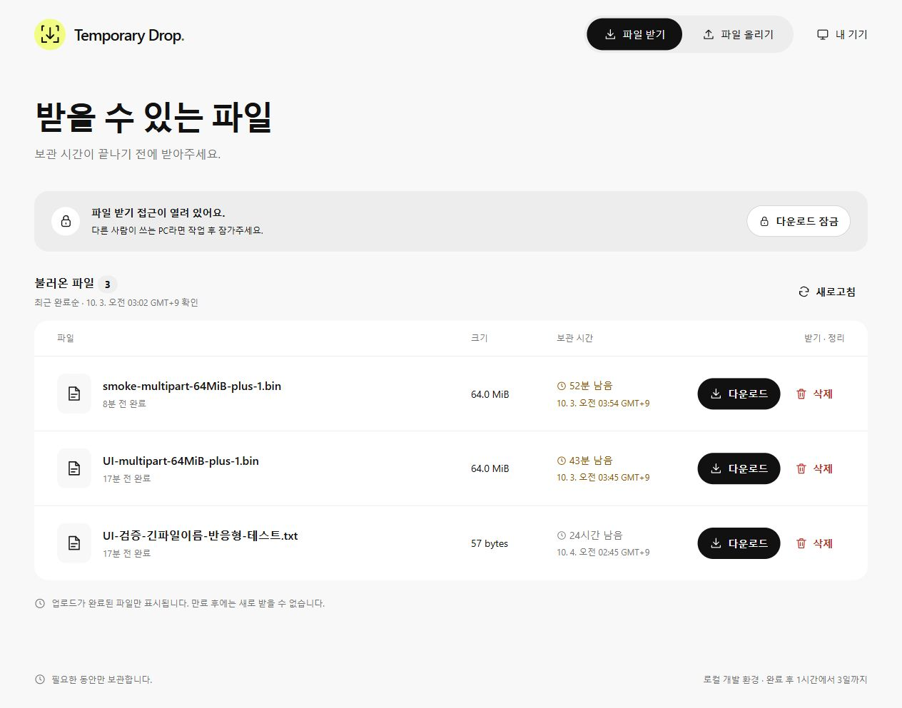
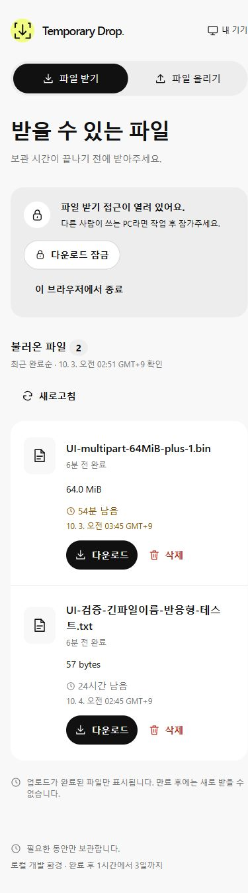
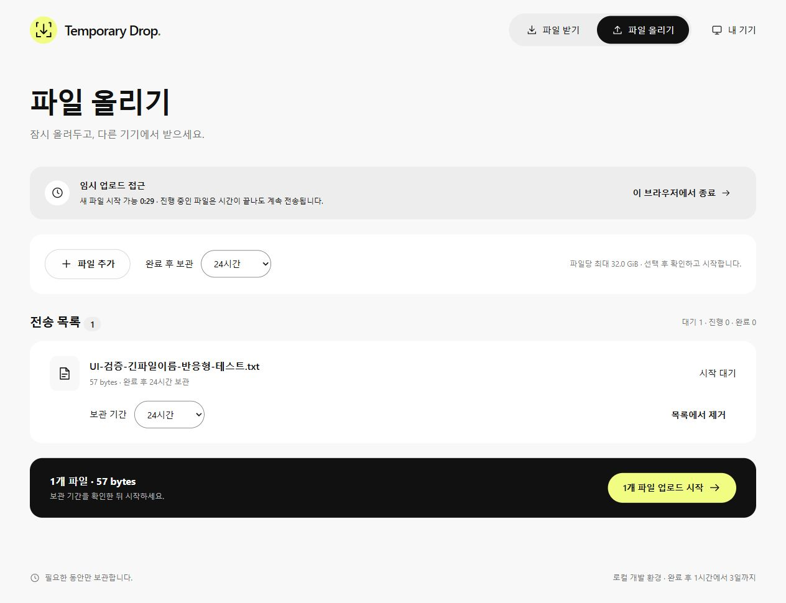
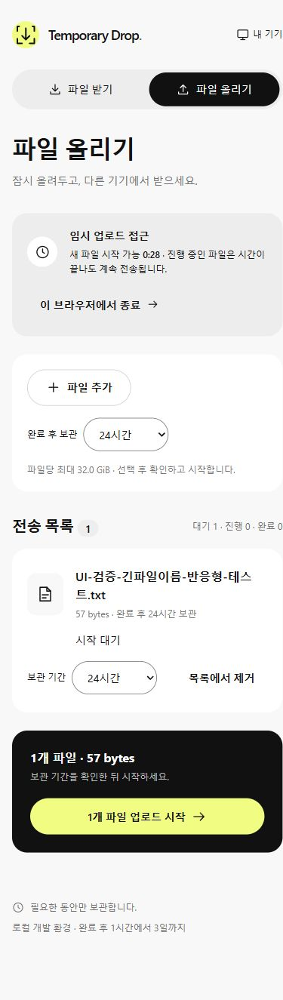

# Temporary Drop 리디자인 구현·검증 기록

작성일: 2026-10-03 (Asia/Seoul)

구현 기준은 [PRD](./04-프런트엔드-전면-리디자인-PRD.md)와 [Assemble 구현 계획](./05-Assemble-디자인-구현-상세계획.md)이다. 이 문서는 실제 구현과 확인한 증거를 기록한다. 모든 출시 QA를 통과했다는 판정은 아니다.

## 1. 적용한 화면 구조

계획의 권장안 A를 구현했다. 사용자 요청인 ‘구현시작’을 기준으로 진행했으며 A/B/C 중 사용자가 별도로 A를 선택했다고 기록하지 않는다.

| 구조 | 동일한 파일 선택·진행 상태에서의 배치 | 판단 |
| --- | --- | --- |
| A 전송 데스크 | 상단 받기/올리기 → 접근 상태 → 선택 후 줄어드는 파일 추가 영역 → 전송 행 → 명시적 시작. 모바일도 같은 순서. | 채택. 확인·시작과 전송 상태가 한 흐름에 있다. |
| B 양쪽 작업대 | 데스크톱 선택 영역과 전송 목록을 양쪽 배치. 모바일은 선택 영역 다음 전송 목록. | 전송 행의 긴 이름·복구 버튼에 쓸 폭이 줄어든다. |
| C 단계형 | 선택 → 검토·시작 → 전송 상태를 단계별 화면으로 구성. 모바일도 단계를 이동한다. | 진행 중 파일 추가와 이전 파일 상태 확인에 이동이 늘어난다. |

```text
A / desktop                     A / mobile
logo   받기 올리기    내 기기      logo              내 기기
파일 올리기                      받기 / 올리기
접근 상태 · 종료                 파일 올리기
[ 파일 추가 / 기본 보관 ]        접근 상태 / 종료
전송 목록 · 개수                 파일 추가 / 기본 보관
[파일명 / 크기 / 상태]           파일명 / 크기 / 상태
[보관 변경 / 제거·복구]          보관 변경 / 제거·복구
[선택한 개수·크기 / 시작]        선택한 개수·크기
                                [업로드 시작]
```

## 2. 구현 범위와 파일

| 요구사항 | 구현 위치 | 적용 내용 |
| --- | --- | --- |
| 공통 디자인 | `src/styles/{tokens,base,components,features}.css`, `src/components/` | 밝은 배경, 흰 표면, 검정 pill 버튼, 라임 강조, 20px 패널, SVG 아이콘, 한글 줄 높이, 729/999px 분기, reduced motion |
| FR-AUTH-01–06 | `src/features/auth/AuthForms.tsx`, `src/hooks/useAuthStatus.ts` | PIN/TOTP 단일 입력, 목적별 인증, 기억·신뢰 기본 OFF, 서버 재시도 시간, 마지막 인증 상태 유지, 연결 오류 재시도 |
| FR-UP-01–12 | `src/features/upload/UploadPage.tsx`, `src/uploader.ts` | 파일별 보관, 미승인 선택과 승인 대기 구분, 명시적 시작, 진행·오프라인·확인·취소·복구, 탭 수명 안내, 완료 이력의 서버 삭제 표시 |
| FR-DOWN-01–07 | `src/features/download/{DownloadPage,listing}.tsx/ts` | 인증 전 목록 비노출, 시간·크기, 새로고침·30초 갱신, 불러온 페이지 범위 유지, 중복 방지, 만료 숨김, 다운로드 잠금 |
| FR-DOWN-08–13 | `src/features/download/DeleteFileDialog.tsx` | 파일명·크기 확인, 신뢰 브라우저 또는 대상에 묶인 TOTP, DELETED 이후 성공, 정리 지연 구분, 삭제 후 목록 갱신, 취소·포커스 복귀 |
| FR-ACCESS-01–08 | `src/App.tsx`, `src/features/devices/DevicesPage.tsx` | 종료 scope, finalizing 보존, 대상별 기기 해제, 1회 토큰 표시·복사·닫기 확인 |
| 단축어 안내 | `src/ShortcutsGuide.tsx`, `/shortcuts` | 작업 중 추가된 안내 파일을 새 디자인에 연결. 기기 관리에서 이동하고 토큰 화면에서는 별도 탭으로 안내를 열 수 있음 |

폰트 파일은 추가하지 않았다. 원본 AnthroTrial을 복제하지 않으며 Inter가 없는 환경은 Segoe UI/Malgun Gothic 등 시스템 폰트를 사용한다. 원본 사진·로고·마케팅 문구를 제품에 가져오지 않았다.

## 3. 전송 동작 변경

- `add()`는 미승인 파일만 만든다. UI는 시작 버튼을 누른 시점의 파일 key 목록을 전달한다. 전송 도중 추가한 파일은 별도 시작 전까지 서버에 생성하지 않는다.
- ‘새로 시작’은 해당 파일만 처리한다. 생성 응답을 잃어 ID를 받지 못한 경우 같은 idempotency key를 유지한다. ID가 있는 경우 기존 서버 상태를 확인하고 취소한 뒤 새로운 요청을 만든다.
- 완료 확인이 지연되면 기존 ID·capability로 결과를 조회한다. 새 파일 생성으로 대체하지 않는다. 확인 중 접근 종료는 서버 파일이 이미 완료될 가능성을 표시한다.
- 다운로드 목록 갱신은 기존에 불러온 페이지 수를 다시 조회한 뒤 한 번에 반영한다. 후속 페이지 실패 시 불완전한 목록으로 교체하지 않는다. 요청 세대 번호로 오래된 결과의 반영을 막는다.
- 서버 삭제와 로컬 전송 목록 제거는 별도 동작이다. 삭제 성공만 해당 결과 ID의 전송 이력에 반영한다.

## 4. 확인한 증거

### 자동 검사

- `npm run check`: 타입·포맷·59개 테스트·프로덕션 빌드 통과.
- 테스트 구성: 기존 API 시험 49개, uploader 시험 7개, 페이지 목록 시험 3개.
- 추가 uploader 시험: 전송 중 추가한 미승인 파일, 생성 응답 유실과 요청 키 보존, 원래 ID로 완료 확인, 접근 종료 시 미확인 결과 보존·삭제 이력 연결, 파트 권한 만료 후 재시작.
- 추가 목록 시험: 삽입·삭제 이후 불러온 범위 유지, 겹친 페이지 중복 방지·cursor 인코딩·목록 끝, 후속 페이지 실패.
- 기존 삭제 API 시험을 재사용하여 신뢰 브라우저·Origin/CSRF·다운로드 세션·대상 grant·저장소 정리 실패 등 권한 계약을 검사했다.
- `npm run deploy:check`: 로컬 설정의 Worker·assets 패키징 dry-run 통과. 운영 환경 배포 검증과는 구분한다.
- 빌드 크기: JS 약 365.4 kB / gzip 110.7 kB, CSS 17.23 kB / gzip 4.20 kB. 이전 빌드와 동일 환경에서의 성능 비교는 미측정이다.

### 실제 Worker와 브라우저

localhost:8787의 로컬 D1/R2에서 합성 fixture만 사용했다. 최초 PIN 요청의 DB 초기화 오류를 확인한 뒤 기존 로컬 migration 3개를 적용하여 해결했다.

| 과업 | 결과 |
| --- | --- |
| PIN·임시 TOTP 인증 | 받기 목록과 올리기 화면 전환 확인. 기억·신뢰 체크 기본 OFF. |
| 다운로드 잠금·재인증 | 잠금 직후 파일 행 0개·파일명 DOM 비노출 확인. 같은 PIN으로 목록 다시 열기 확인. |
| 파일 2개 선택·보관 변경·명시적 시작 | 작은 텍스트 파일과 64 MiB + 1 byte 파일. 선택만으로 시작되지 않음. 큰 파일 보관 1시간 적용. |
| 전송 중 페이지 이동 | 받기 화면에 전송 상태 Dock 표시. 올리기로 돌아와 두 파일 READY 표시 확인. |
| 브라우저 다운로드 | 67,108,865 bytes. 원본과 SHA-256 일치. 해시 `2b5b7cedb658387beb0c2c213786cb2182ab82d510fdaa5807f431aee0ed78d4`. |
| 삭제 모달 | 실제 파일명·크기, 대상 TOTP 요구, 복구 불가·이미 받은 데이터 안내 확인. 취소 후 원래 삭제 버튼에 포커스 복귀. UI에서 영구 삭제 제출은 수행하지 않음. |
| 기기 관리 | 별도 관리 TOTP 인증 후 빈 기기 목록 확인. `/shortcuts` 안내 경로와 모바일 긴 코드 문단 확인. |
| 반응형 | 320/390/768/999/1000/1440px에서 받기 목록 가로 넘침 없음. 다운로드·삭제 버튼 높이 44px 유지. 729px override는 도구에서 실제 730px로 보고되어 정확한 729px 브라우저 경계 검증은 남음. |
| 브라우저 로그 | 정상 파일 전송 흐름에서 error/warn 없음. |

별도 `npm run smoke:local`도 통과했다. 64 MiB + 1 byte / 2 parts의 해시 `db06a3cba93535048b096474d502e91c737410edda4ff81abcfc93e82cc922e9`와 파트 경계를 가로지르는 Range(206) 응답을 검증했다.

### 화면 증거









## 5. 남은 출시 검증

구현은 로컬 코드에 반영되었다. iPhone/Safari 실기기, VoiceOver·스크린리더 전체 과업, 200% 텍스트/400% 브라우저 확대, 모바일 키보드·safe area, GiB급 파일의 실기기 전송은 아직 검증하지 않았다. 토큰 발급·복사 실패·현재 기기 해제·신뢰 브라우저 삭제의 새 UI 전체 과업과 15분 만료 경계도 출시 전에 수동 검증해야 한다. 이 항목을 테스트 통과나 디자인 스크린샷으로 대체하지 않는다.

로컬 확인 명령은 `npm run build` 후 `npm run dev`이다. 프런트 변경을 즉시 확인하려면 Worker와 `npm run dev:ui`를 함께 실행한다. 이 작업은 원격 배포·Git push를 수행하지 않는다.
